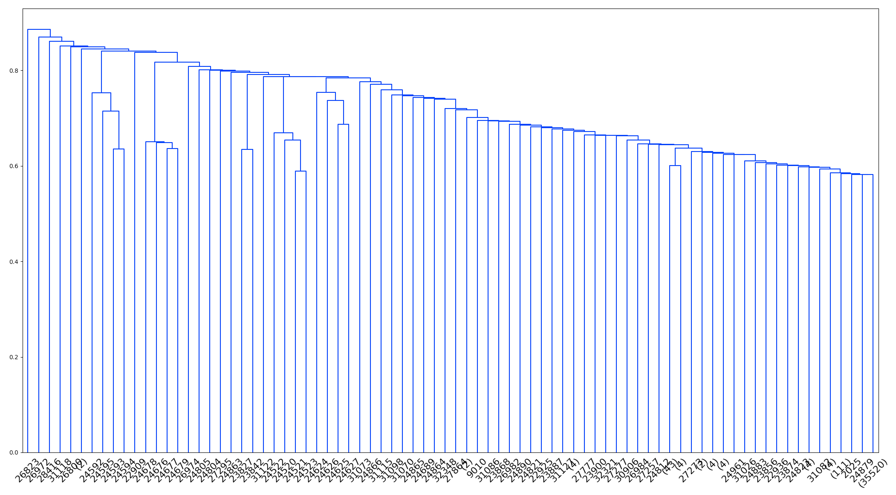

```{r setup, echo=0, warning=0, message=0}

library(knitr)
opts_knit$set(upload.fun = image_uri, root.dir = '/Users/Jake/Documents/Projects/Mercator/')

library(ggplot2)
library(reshape2)
library(gridExtra)
library(dbplyr)
library(dplyr)
library(RPostgreSQL)
library(jsonlite)
library(plotly)
library(arrangements)

```

<!-- ```{r hclust-plot-k160, echo=0, warning=0, message=0, fig.width=16, fig.height=12} -->

<!-- hclust.dat <- read.table('results/recount/clustering/recount_hclust_allPoints_750_dim_noProj_over50_bulkOnly_cosine.csv',sep=',') -->

<!-- sample.labels <- readRDS('data/tmp/sample_labels_bulkOnly.RDS') -->

<!-- rownames(hclust.dat) <- sample.labels -->
<!-- colnames(hclust.dat) <- sapply((1:20)*10,function(x) sprintf('K%d',x)) -->

<!-- tsne.dat <- data.frame(readRDS('results/recount/tsne/recount_tsne_pca_noNAs_over50_bulkOnly_p40.RDS')) -->
<!-- colnames(tsne.dat) <- c('X1','X2') -->

<!-- tsne.meta <- readRDS('src/tsne_shiny/data/recount_meta.RDS') -->
<!-- rownames(tsne.meta) <- tsne.meta$run_id -->
<!-- tsne.meta <- tsne.meta[rownames(tsne.dat),] -->

<!-- tsne.dat <- cbind(tsne.dat,hclust.dat) -->
<!-- tsne.dat$proj_id <- tsne.meta$proj_id -->

<!-- g <- plot_ly(tsne.dat,x=~X1,y=~X2,mode='markers',type='scattergl',color=~as.factor(K160),  -->
<!--              text=~paste('ID: ',proj_id)) %>%  -->
<!--     layout(  -->
<!--         title = 'Hclust n=160, cosine, all points') -->

<!-- g -->

<!-- ``` -->

<!-- Hclust all points cosine -->

<!--  -->

<!-- ```{r hclust-plot-k160-euc, echo=0, warning=0, message=0, fig.width=16, fig.height=12} -->

<!-- hclust.dat <- read.table('results/recount/clustering/recount_hclust_allPoints_750_dim_noProj_over50_bulkOnly_euclidean.csv',sep=',') -->

<!-- sample.labels <- readRDS('data/tmp/sample_labels_bulkOnly.RDS') -->

<!-- rownames(hclust.dat) <- sample.labels -->
<!-- colnames(hclust.dat) <- sapply((1:20)*10,function(x) sprintf('K%d',x)) -->

<!-- tsne.dat <- data.frame(readRDS('results/recount/tsne/recount_tsne_pca_noNAs_over50_bulkOnly_p40.RDS')) -->
<!-- colnames(tsne.dat) <- c('X1','X2') -->

<!-- ## tsne.meta <- readRDS('src/tsne_shiny/data/recount_meta.RDS') -->
<!-- ## rownames(tsne.meta) <- tsne.meta$run_id -->
<!-- ## tsne.meta <- tsne.meta[rownames(tsne.dat),] -->

<!-- tsne.dat <- cbind(tsne.dat,hclust.dat) -->
<!-- tsne.dat$proj_id <- tsne.meta$proj_id -->

<!-- g <- plot_ly(tsne.dat,x=~X1,y=~X2,mode='markers',type='scattergl',color=~as.factor(K200),  -->
<!--              text=~paste('ID: ',proj_id)) %>%  -->
<!--     layout(  -->
<!--         title = 'Hclust n=160, cosine, all points') -->

<!-- g -->

<!-- ``` -->


<!-- ```{r louvain-k40-graph-r1e-2, echo=0, warning=0, message=0, fig.width=16, fig.height=12} -->

<!-- louvain.dat <- read.table('results/recount/clustering/louvain_pca_over50_bulkOnly_k40_graph.tsv',sep='\t') -->

<!-- sample.labels <- readRDS('data/tmp/sample_labels_bulkOnly.RDS') -->

<!-- rownames(louvain.dat) <- sample.labels -->
<!-- louvain.dat <- louvain.dat[rownames(tsne.dat),] -->
<!-- ## tsne.dat <- data.frame(readRDS('results/recount/tsne/recount_tsne_pca_noNAs_over50_bulkOnly_p40.RDS')) -->
<!-- ## colnames(tsne.dat) <- c('X1','X2') -->

<!-- tsne.dat$louvain <- louvain.dat$V2 -->
<!-- ## tsne.dat$proj_id <- tsne.meta$proj_id -->

<!-- g <- plot_ly(tsne.dat,x=~X1,y=~X2,mode='markers',type='scattergl',color=~as.factor(louvain),  -->
<!--              text=~paste('ID: ',proj_id)) %>%  -->
<!--     layout(  -->
<!--         title = 'Hclust n=160, cosine, all points') -->

<!-- g -->

<!-- ``` -->

<!-- ```{r leiden-k40-graph-r1e-2, echo=0, warning=0, message=0, fig.width=16, fig.height=12} -->

<!-- leiden.dat <- read.table('results/recount/clustering/leiden_pca_r1e-2_over50_bulkOnly_k40_graph.tsv',sep='\t') -->

<!-- sample.labels <- readRDS('data/tmp/sample_labels_bulkOnly.RDS') -->

<!-- rownames(leiden.dat) <- sample.labels -->
<!-- leiden.dat <- leiden.dat[rownames(tsne.dat),] -->

<!-- ## tsne.dat <- data.frame(readRDS('results/recount/tsne/recount_tsne_pca_noNAs_over50_bulkOnly_p40.RDS')) -->
<!-- ## colnames(tsne.dat) <- c('X1','X2') -->

<!-- tsne.dat$leiden <- leiden.dat$V2 -->
<!-- ## tsne.dat$proj_id <- tsne.meta$proj_id -->

<!-- g <- plot_ly(tsne.dat,x=~X1,y=~X2,mode='markers',type='scattergl',color=~as.factor(leiden),  -->
<!--              text=~paste('ID: ',proj_id)) %>%  -->
<!--     layout(  -->
<!--         title = 'Hclust n=160, cosine, all points') -->

<!-- g -->

<!-- ``` -->


<!-- ```{r leiden-k40-graph-r5e-3, echo=0, warning=0, message=0, fig.width=16, fig.height=12} -->

<!-- leiden.dat <- read.table('results/recount/clustering/leiden_r5e-3_pca_over50_bulkOnly_k40_graph.tsv',sep='\t') -->

<!-- sample.labels <- readRDS('data/tmp/sample_labels_bulkOnly.RDS') -->

<!-- rownames(leiden.dat) <- sample.labels -->
<!-- leiden.dat <- leiden.dat[rownames(tsne.dat),] -->

<!-- ## tsne.dat <- data.frame(readRDS('results/recount/tsne/recount_tsne_pca_noNAs_over50_bulkOnly_p40.RDS')) -->
<!-- ## colnames(tsne.dat) <- c('X1','X2') -->

<!-- tsne.dat$leiden <- leiden.dat$V2 -->
<!-- ## tsne.dat$proj_id <- tsne.meta$proj_id -->

<!-- g <- plot_ly(tsne.dat,x=~X1,y=~X2,mode='markers',type='scattergl',color=~as.factor(leiden),  -->
<!--              text=~paste('ID: ',proj_id)) %>%  -->
<!--     layout(  -->
<!--         title = 'Hclust n=160, cosine, all points') -->

<!-- g -->

<!-- ``` -->


<!-- ```{r leiden-k40-sim-r5e-3, echo=0, warning=0, message=0, fig.width=16, fig.height=12} -->

<!-- leiden.dat <- read.table('results/recount/clustering/leiden_r5e-3_pca_over50_bulkOnly_k40_sim.tsv',sep='\t') -->

<!-- sample.labels <- readRDS('data/tmp/sample_labels_bulkOnly.RDS') -->

<!-- rownames(leiden.dat) <- sample.labels -->
<!-- leiden.dat <- leiden.dat[rownames(tsne.dat),] -->

<!-- ## tsne.dat <- data.frame(readRDS('results/recount/tsne/recount_tsne_pca_noNAs_over50_bulkOnly_p40.RDS')) -->
<!-- ## colnames(tsne.dat) <- c('X1','X2') -->

<!-- tsne.dat$leiden <- leiden.dat$V2 -->
<!-- ## tsne.dat$proj_id <- tsne.meta$proj_id -->

<!-- g <- plot_ly(tsne.dat,x=~X1,y=~X2,mode='markers',type='scattergl',color=~as.factor(leiden),  -->
<!--              text=~paste('ID: ',proj_id)) %>%  -->
<!--     layout(  -->
<!--         title = 'Hclust n=160, cosine, all points') -->

<!-- g -->

<!-- ``` -->


```{r leiden-tissue-detail-analysis-graph, echo=0, warning=0, message=0, fig.width=8, fig.height=6}

sample.labels <- readRDS('data/tmp/sample_labels_bulkOnly.RDS')

## leiden.001 <- read.table('results/recount/clustering/leiden_pca_r1e-2_over50_bulkOnly_k40_graph.tsv',sep='\t')
## rownames(leiden.001) <- sample.labels

## leiden.0005 <- read.table('results/recount/clustering/leiden_r5e-3_pca_over50_bulkOnly_k40_graph.tsv',sep='\t')
## rownames(leiden.0005) <- sample.labels

## leiden.sim.0005 <- read.table('results/recount/clustering/leiden_r5e-3_pca_over50_bulkOnly_k40_sim.tsv',sep='\t')

cluster.df <- read.table('results/recount/clustering/leiden_rsweep_pca_over50_bulkOnly_k40_graph.tsv',sep='\t',row.names=1)
rownames(cluster.df) <- sample.labels
colnames(cluster.df) <- c('0.1', '0.075', '0.05', '0.025', '0.01', '0.0075', '0.005', '0.0025', '0.001', '0.00075', '0.0005', '0.00025', '0.00001')

tcga.gtex.meta <- readRDS('src/tsne_shiny/data/gtex_tcga_meta.RDS')
rownames(tcga.gtex.meta) <- tcga.gtex.meta$data_id

tissue.det.vec <- rep(NA,length(sample.labels))
names(tissue.det.vec) <- sample.labels
tissue.det.vec[rownames(tcga.gtex.meta)] <- tcga.gtex.meta$tissue_detail

clus.pur.list <- lapply(cluster.df,function(x) rep(0,length(unique(x))))                      

cluster.df$tissue_det <- tissue.det.vec

## cluster.df <- cbind(r001=leiden001$V2,r0005=leiden0005$V2,tissue_det=tissue.det.vec)

tis.res.df <- data.frame()

## clus.pur.list <- list(r001 = rep(0,length(unique(cluster.df$r001))),
##                      r0005 = rep(0,length(unique(cluster.df$r0005)))
##                      )

for(label in unique(tissue.det.vec[!is.na(tissue.det.vec)])){

    tis.slice <- subset(cluster.df,tissue_det == label)

    tis.res.df <- rbind(tis.res.df,apply(tis.slice[1:ncol(tis.slice)-1],2,function(x) length(table(x))))

    for(param.label in colnames(tis.slice[1:ncol(tis.slice)-1])){

        entry <- clus.pur.list[[param.label]]

        clus.containing.tissue <- unique(tis.slice[[param.label]])

        entry[clus.containing.tissue+1] <- entry[clus.containing.tissue+1]+1

        clus.pur.list[[param.label]] <- entry

    }

}

colnames(tis.res.df) <- c('0.1', '0.075', '0.05', '0.025', '0.01', '0.0075', '0.005', '0.0025', '0.001', '0.00075', '0.0005', '0.00025', '0.00001')
rownames(tis.res.df) <- unique(tissue.det.vec[!is.na(tissue.det.vec)])

tiss.pur.measure <- apply(tis.res.df,2,mean)

clus.pur.measure <- sapply(clus.pur.list,function(x) sum(x[x>0])/length(x[x>0]))

res.df <- data.frame(tissue.purity=tiss.pur.measure,clus.purity=clus.pur.measure)
res.df <- rbind(res.df,c(1,1))
rownames(res.df) <- c('0.1', '0.075', '0.05', '0.025', '0.01', '0.0075', '0.005', '0.0025', '0.001', '0.00075', '0.0005', '0.00025', '0.00001','gold')

g <- ggplot(res.df,aes(x=tissue.purity,y=clus.purity,label=rownames(res.df))) + geom_point(shape=15,colour='white',size=6) + geom_text() +
    ggtitle('Leiden R-sweep K-NN graph analysis')

g

clus.nums <- c(sapply(cluster.df[1:ncol(cluster.df)-1],function(x) length(unique(x))),1)
names(clus.nums) <- rownames(res.df)

## clus.nums

dist <- sqrt((res.df$tissue.purity-1)^2+(res.df$clus.purity-1)^2)
names(dist) <- rownames(res.df)

## dist

median.clus.size <- c(sapply(cluster.df[1:ncol(cluster.df)-1],function(x) median(table(x))),1)

a <- data.frame(clus.nums,dist,median.clus.size)
rownames(a) <- rownames(res.df)

a

```

```{r leiden-tissue-detail-analysis-sim, echo=0, warning=0, message=0, fig.width=8, fig.height=6}

sample.labels <- readRDS('data/tmp/sample_labels_bulkOnly.RDS')

## leiden.001 <- read.table('results/recount/clustering/leiden_pca_r1e-2_over50_bulkOnly_k40_graph.tsv',sep='\t')
## rownames(leiden.001) <- sample.labels

## leiden.0005 <- read.table('results/recount/clustering/leiden_r5e-3_pca_over50_bulkOnly_k40_graph.tsv',sep='\t')
## rownames(leiden.0005) <- sample.labels

## leiden.sim.0005 <- read.table('results/recount/clustering/leiden_r5e-3_pca_over50_bulkOnly_k40_sim.tsv',sep='\t')

cluster.df <- read.table('results/recount/clustering/leiden_rsweep_pca_over50_bulkOnly_k40_sim.tsv',sep='\t',row.names=1)
rownames(cluster.df) <- sample.labels
colnames(cluster.df) <- c('0.1', '0.075', '0.05', '0.025', '0.01', '0.0075', '0.005', '0.0025', '0.001', '0.00075', '0.0005', '0.00025', '0.00001')

tcga.gtex.meta <- readRDS('src/tsne_shiny/data/gtex_tcga_meta.RDS')
rownames(tcga.gtex.meta) <- tcga.gtex.meta$data_id

tissue.det.vec <- rep(NA,length(sample.labels))
names(tissue.det.vec) <- sample.labels
tissue.det.vec[rownames(tcga.gtex.meta)] <- tcga.gtex.meta$tissue_detail

clus.pur.list <- lapply(cluster.df,function(x) rep(0,length(unique(x))))

cluster.df$tissue_det <- tissue.det.vec

## cluster.df <- cbind(r001=leiden001$V2,r0005=leiden0005$V2,tissue_det=tissue.det.vec)

tis.res.df <- data.frame()

## clus.pur.list <- list(r001 = rep(0,length(unique(cluster.df$r001))),
##                      r0005 = rep(0,length(unique(cluster.df$r0005)))
##                      )

for(label in unique(tissue.det.vec[!is.na(tissue.det.vec)])){

    tis.slice <- subset(cluster.df,tissue_det == label)

    tis.res.df <- rbind(tis.res.df,apply(tis.slice[1:ncol(tis.slice)-1],2,function(x) length(table(x))))

    for(param.label in colnames(tis.slice[1:ncol(tis.slice)-1])){

        entry <- clus.pur.list[[param.label]]

        clus.containing.tissue <- unique(tis.slice[[param.label]])

        entry[clus.containing.tissue+1] <- entry[clus.containing.tissue+1]+1

        clus.pur.list[[param.label]] <- entry

    }

}

colnames(tis.res.df) <- c('0.1', '0.075', '0.05', '0.025', '0.01', '0.0075', '0.005', '0.0025', '0.001', '0.00075', '0.0005', '0.00025', '0.00001')
rownames(tis.res.df) <- unique(tissue.det.vec[!is.na(tissue.det.vec)])

tiss.pur.measure <- apply(tis.res.df,2,mean)

clus.pur.measure <- sapply(clus.pur.list,function(x) sum(x[x>0])/length(x[x>0]))

res.df <- data.frame(tissue.purity=tiss.pur.measure,clus.purity=clus.pur.measure)
res.df <- rbind(res.df,c(1,1))
rownames(res.df) <- c('0.1', '0.075', '0.05', '0.025', '0.01', '0.0075', '0.005', '0.0025', '0.001', '0.00075', '0.0005', '0.00025', '0.00001','gold')

g <- ggplot(res.df,aes(x=tissue.purity,y=clus.purity,label=rownames(res.df))) + geom_point(shape=15,colour='white',size=6) + geom_text() +
    ggtitle('Leiden R-sweep K-NN similarity graph analysis')

g

clus.nums <- c(sapply(cluster.df[1:ncol(cluster.df)-1],function(x) length(unique(x))),1)
names(clus.nums) <- rownames(res.df)

## clus.nums

dist <- sqrt((res.df$tissue.purity-1)^2+(res.df$clus.purity-1)^2)
names(dist) <- rownames(res.df)

median.clus.size <- c(sapply(cluster.df[1:ncol(cluster.df)-1],function(x) median(table(x))),1)

## dist

a <- data.frame(clus.nums,dist,median.clus.size)
rownames(a) <- rownames(res.df)

a

```

```{r leiden-k40-graph-r5e-3, echo=0, warning=0, message=0, fig.width=16, fig.height=12}

tsne.dat <- data.frame(readRDS('results/recount/tsne/recount_tsne_pca_noNAs_over50_bulkOnly_p40.RDS'))
colnames(tsne.dat) <- c('X1','X2')

leiden.dat <- read.table('results/recount/clustering/leiden_rsweep_pca_over50_bulkOnly_k40_graph.tsv',sep='\t',row.names=1)
sample.labels <- readRDS('data/tmp/sample_labels_bulkOnly.RDS')
rownames(leiden.dat) <- sample.labels
colnames(leiden.dat) <- c('0.1', '0.075', '0.05', '0.025', '0.01', '0.0075', '0.005', '0.0025', '0.001', '0.00075', '0.0005', '0.00025', '0.00001')

leiden.dat <- leiden.dat[rownames(tsne.dat),]

tsne.meta <- readRDS('src/tsne_shiny/data/recount_meta.RDS')
rownames(tsne.meta) <- tsne.meta$run_id
tsne.meta <- tsne.meta[rownames(tsne.dat),]

tsne.dat$proj_id <- tsne.meta$proj_id

## tsne.dat <- data.frame(readRDS('results/recount/tsne/recount_tsne_pca_noNAs_over50_bulkOnly_p40.RDS'))
## colnames(tsne.dat) <- c('X1','X2')

tsne.dat$leiden <- leiden.dat[['0.005']]
## tsne.dat$proj_id <- tsne.meta$proj_id

g <- plot_ly(tsne.dat,x=~X1,y=~X2,mode='markers',type='scattergl',color=~as.factor(leiden),
             text=~paste('ID: ',proj_id)) %>%
    layout(
        title = 'Leiden r=0.005 k-NN graph')

g

```


```{r leiden-k40-sim-r75e-4, echo=0, warning=0, message=0, fig.width=16, fig.height=12}

tsne.dat <- data.frame(readRDS('results/recount/tsne/recount_tsne_pca_noNAs_over50_bulkOnly_p40.RDS'))
colnames(tsne.dat) <- c('X1','X2')

leiden.dat <- read.table('results/recount/clustering/leiden_rsweep_pca_over50_bulkOnly_k40_sim.tsv',sep='\t',row.names=1)
sample.labels <- readRDS('data/tmp/sample_labels_bulkOnly.RDS')
rownames(leiden.dat) <- sample.labels
colnames(leiden.dat) <- c('0.1', '0.075', '0.05', '0.025', '0.01', '0.0075', '0.005', '0.0025', '0.001', '0.00075', '0.0005', '0.00025', '0.00001')

leiden.dat <- leiden.dat[rownames(tsne.dat),]

tsne.meta <- readRDS('src/tsne_shiny/data/recount_meta.RDS')
rownames(tsne.meta) <- tsne.meta$run_id
tsne.meta <- tsne.meta[rownames(tsne.dat),]

tsne.dat$proj_id <- tsne.meta$proj_id

## tsne.dat <- data.frame(readRDS('results/recount/tsne/recount_tsne_pca_noNAs_over50_bulkOnly_p40.RDS'))
## colnames(tsne.dat) <- c('X1','X2')

tsne.dat$leiden <- leiden.dat[['0.0075']]
## tsne.dat$proj_id <- tsne.meta$proj_id

g <- plot_ly(tsne.dat,x=~X1,y=~X2,mode='markers',type='scattergl',color=~as.factor(leiden),
             text=~paste('ID: ',proj_id)) %>%
    layout(
        title = 'Leiden r=0.0075 similarity')

g

```
```{r leiden-k40-sim-r1e-2, echo=0, warning=0, message=0, fig.width=16, fig.height=12}

tsne.dat <- data.frame(readRDS('results/recount/tsne/recount_tsne_pca_noNAs_over50_bulkOnly_p40.RDS'))
colnames(tsne.dat) <- c('X1','X2')

leiden.dat <- read.table('results/recount/clustering/leiden_rsweep_pca_over50_bulkOnly_k40_sim.tsv',sep='\t',row.names=1)
sample.labels <- readRDS('data/tmp/sample_labels_bulkOnly.RDS')
rownames(leiden.dat) <- sample.labels
colnames(leiden.dat) <- c('0.1', '0.075', '0.05', '0.025', '0.01', '0.0075', '0.005', '0.0025', '0.001', '0.00075', '0.0005', '0.00025', '0.00001')

leiden.dat <- leiden.dat[rownames(tsne.dat),]

tsne.meta <- readRDS('src/tsne_shiny/data/recount_meta.RDS')
rownames(tsne.meta) <- tsne.meta$run_id
tsne.meta <- tsne.meta[rownames(tsne.dat),]

tsne.dat$proj_id <- tsne.meta$proj_id

## tsne.dat <- data.frame(readRDS('results/recount/tsne/recount_tsne_pca_noNAs_over50_bulkOnly_p40.RDS'))
## colnames(tsne.dat) <- c('X1','X2')

tsne.dat$leiden <- leiden.dat[['0.01']]
## tsne.dat$proj_id <- tsne.meta$proj_id

g <- plot_ly(tsne.dat,x=~X1,y=~X2,mode='markers',type='scattergl',color=~as.factor(leiden),
             text=~paste('ID: ',proj_id)) %>%
    layout(
        title = 'Leiden r=0.01 similarity')

g

```


```{r leiden-k40-sim-r25e-3, echo=0, warning=0, message=0, fig.width=16, fig.height=12}

tsne.dat <- data.frame(readRDS('results/recount/tsne/recount_tsne_pca_noNAs_over50_bulkOnly_p40.RDS'))
colnames(tsne.dat) <- c('X1','X2')

leiden.dat <- read.table('results/recount/clustering/leiden_rsweep_pca_over50_bulkOnly_k40_sim.tsv',sep='\t',row.names=1)
sample.labels <- readRDS('data/tmp/sample_labels_bulkOnly.RDS')
rownames(leiden.dat) <- sample.labels
colnames(leiden.dat) <- c('0.1', '0.075', '0.05', '0.025', '0.01', '0.0075', '0.005', '0.0025', '0.001', '0.00075', '0.0005', '0.00025', '0.00001')

leiden.dat <- leiden.dat[rownames(tsne.dat),]

tsne.meta <- readRDS('src/tsne_shiny/data/recount_meta.RDS')
rownames(tsne.meta) <- tsne.meta$run_id
tsne.meta <- tsne.meta[rownames(tsne.dat),]

tsne.dat$proj_id <- tsne.meta$proj_id

## tsne.dat <- data.frame(readRDS('results/recount/tsne/recount_tsne_pca_noNAs_over50_bulkOnly_p40.RDS'))
## colnames(tsne.dat) <- c('X1','X2')

tsne.dat$leiden <- leiden.dat[['0.025']]
## tsne.dat$proj_id <- tsne.meta$proj_id

g <- plot_ly(tsne.dat,x=~X1,y=~X2,mode='markers',type='scattergl',color=~as.factor(leiden),
             text=~paste('ID: ',proj_id)) %>%
    layout(
        title = 'Leiden r=0.025 similarity')

g

```

```{r leiden-k40-sim-r5e-2, echo=0, warning=0, message=0, fig.width=16, fig.height=12}

tsne.dat <- data.frame(readRDS('results/recount/tsne/recount_tsne_pca_noNAs_over50_bulkOnly_p40.RDS'))
colnames(tsne.dat) <- c('X1','X2')

leiden.dat <- read.table('results/recount/clustering/leiden_rsweep_pca_over50_bulkOnly_k40_sim.tsv',sep='\t',row.names=1)
sample.labels <- readRDS('data/tmp/sample_labels_bulkOnly.RDS')
rownames(leiden.dat) <- sample.labels
colnames(leiden.dat) <- c('0.1', '0.075', '0.05', '0.025', '0.01', '0.0075', '0.005', '0.0025', '0.001', '0.00075', '0.0005', '0.00025', '0.00001')

leiden.dat <- leiden.dat[rownames(tsne.dat),]

tsne.meta <- readRDS('src/tsne_shiny/data/recount_meta.RDS')
rownames(tsne.meta) <- tsne.meta$run_id
tsne.meta <- tsne.meta[rownames(tsne.dat),]

tsne.dat$proj_id <- tsne.meta$proj_id

## tsne.dat <- data.frame(readRDS('results/recount/tsne/recount_tsne_pca_noNAs_over50_bulkOnly_p40.RDS'))
## colnames(tsne.dat) <- c('X1','X2')

tsne.dat$leiden <- leiden.dat[['0.05']]
## tsne.dat$proj_id <- tsne.meta$proj_id

g <- plot_ly(tsne.dat,x=~X1,y=~X2,mode='markers',type='scattergl',color=~as.factor(leiden),
             text=~paste('ID: ',proj_id)) %>%
    layout(
        title = 'Leiden r=0.05 similarity')

g

```


<!--  -->


